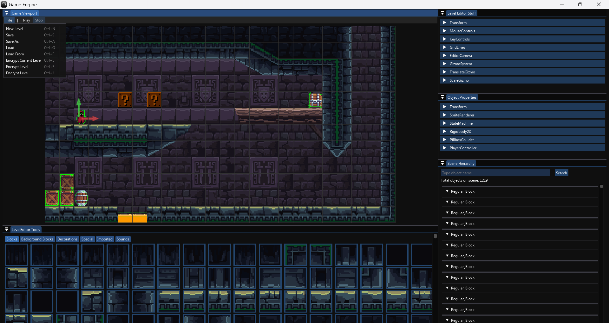
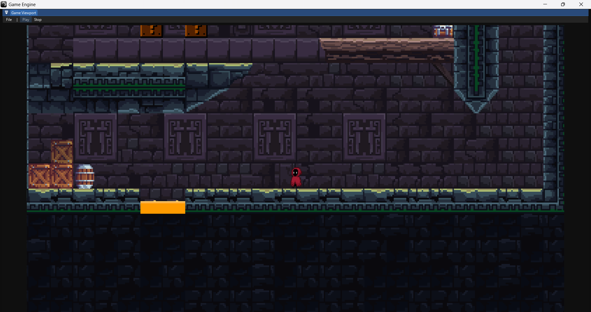

# 2D Platformer Game Engine

In this bachelor's qualification work, a game engine was developed for creating 2D platformer games. The purpose of the application is to provide beginner developers with opportunities to create simple platform games using an intuitive Drag-and-Drop editor and standard implemented features, and for advanced developers to provide opportunities to improve the engine with the help of their ideas and implementations.

## Features

- **Drag-and-Drop Editor**: Easily create and save game levels.
- **Integrated Testing**: Test game levels directly within the editor.
- **Physics Engine**: Add physics to objects placed on the stage.
- **Object Properties**: Change object characteristics such as weight, height, width, and transparency.

## Technologies Used

- **Java**: Primary programming language.
- **LWJGL**: Lightweight Java Game Library for game development.
- **OpenGL**: API for rendering 2D and 3D vector graphics.
- **ImGui**: Immediate Mode Graphical User Interface.
- **GSON**: Tool for serialization and deserialization of data.
- **OpenAL**: Audio programming interface for managing sound.

## Installation

1. Clone the repository:
    ```bash
    git clone https://github.com/EvchevDenis/GameEngine
    ```
2. Navigate to the project directory:
    ```bash
    cd GameEngine
    ```
3. Build the project:
    ```bash
    ./gradlew build
    ```
4. Run the application:
    ```bash
    ./gradlew run
    ```

## Usage

1. Open the Drag-and-Drop editor to start creating your game levels.
2. Use the provided tools to add objects, set their properties, and design your game.
3. Save your game levels for later editing or testing.
4. Test your game levels directly within the editor.

## Screenshots




## Contributing

1. Fork the repository.
2. Create a new branch (`git checkout -b feature/your-feature`).
3. Make your changes and commit them (`git commit -m 'Add some feature'`).
4. Push to the branch (`git push origin feature/your-feature`).
5. Open a Pull Request.

## License

This project is licensed under the MIT License - see the [LICENSE](LICENSE) file for details.

## Acknowledgements

- [LWJGL](https://www.lwjgl.org/)
- [OpenGL](https://www.opengl.org/)
- [ImGui](https://github.com/ocornut/imgui)
- [GSON](https://github.com/google/gson)
- [OpenAL](https://www.openal.org/)
